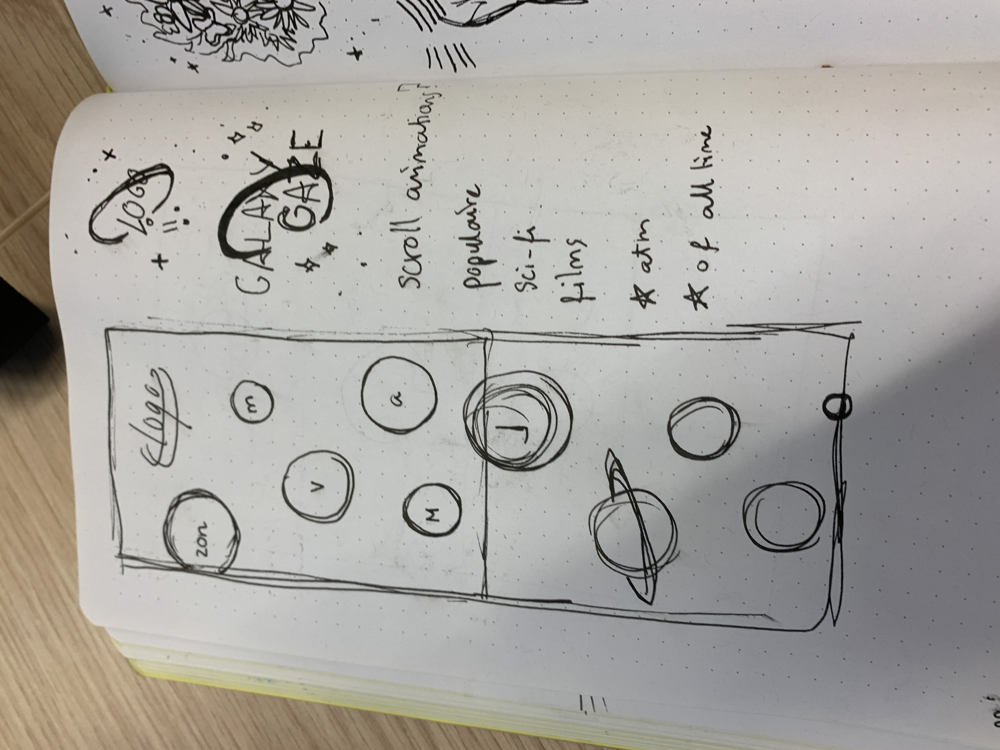
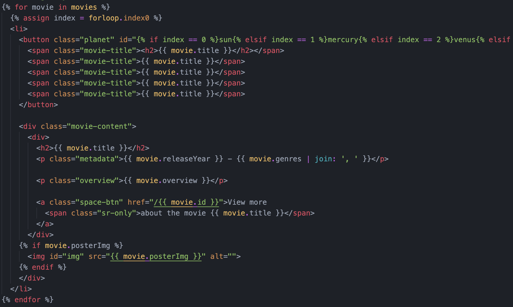
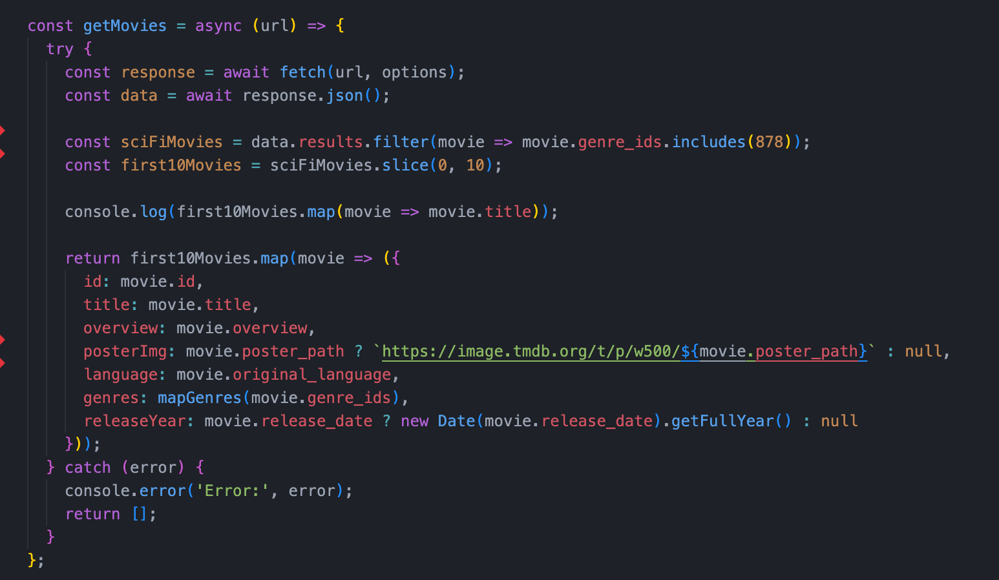
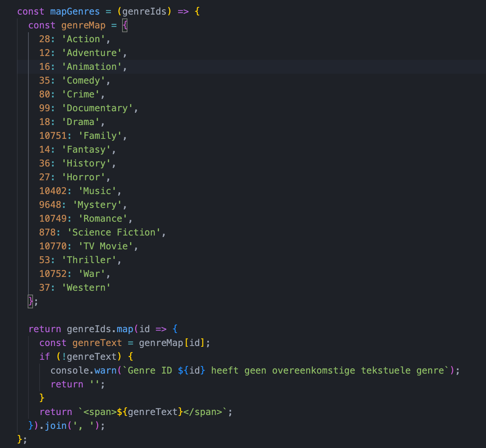
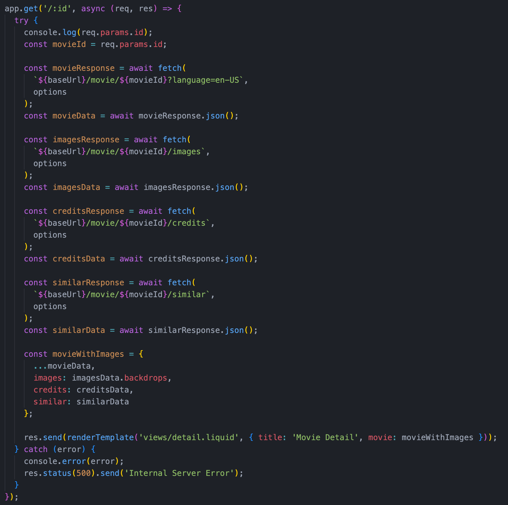
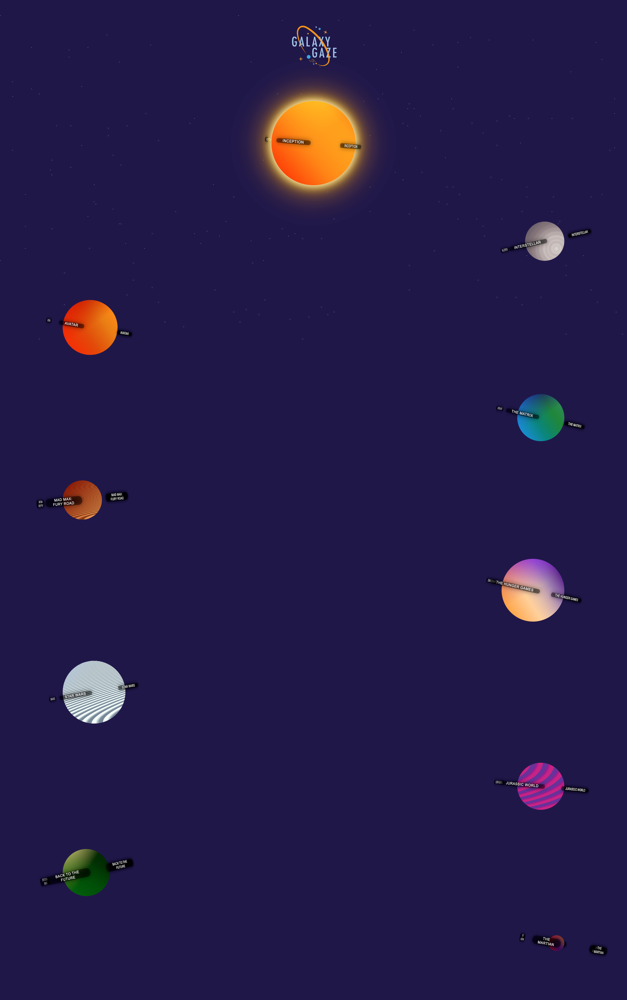

# welkom
bij api
super vet
dit was mijn proces

## week 1

## week 2 & 3
dit is mijn final sketch voor het project, ik wil planeetjes maken met de top 10 scifi films eraan gekoppeld.

ik ben begonnen met het lezen van de documentatie van liquid. ik had al eerder met handlebars en laravel blade gewerkt als templating engines, dus ik wist wel een beetje wat je ermee zou kunnen.

maar ik ben technisch niet echt een held dus ik heb me gewoon gehouden aan het template dingetje van de api repo.

ik snapte overigens niks van node en blok tech liet me ooit huilen dus verwacht niet al te veel van mijn kennis van dit hele gebeuren.

het internet heeft me geholpen loops te schrijven om de films & diens informatie in te laden. ik heb ook een planet id meegegeven aan de list items.

ik heb een (volgens mij niet hele efficiente) functie gemaakt om movie data te fetchen, de scifi eruit te halen en de eerste tien filmpies terug te geven in een array. 

for some reason kreeg ik t niet voor elkaar om de genre namen te fetchen dus k heb met mn beste vriend chatgpt een array met genres gemaakt zodat ik ze toch nog in kon laden

voor de detailpagina heb ik het id van de film in de url gezet en gebaseerd hierop nieuwe informatie gefetcht door het unieke id in de baseUrl te injecteren. dat is volgens mij niet helemaal hoe het hoort maar dat is wel hoe het werkt.

dit is mn final homepage geworden 

src:
- chatgpt :$
- https://www.themoviedb.org/talk/56d5ef6ec3a3681e3c019e43
- https://codepen.io/shooft/pen/jORqgdg
- https://shopify.github.io/liquid/
- https://github.com/Shopify/liquid
- https://developer.mozilla.org/en-US/docs/Web/CSS/@property
- https://stackoverflow.com/questions/33879896/how-to-execute-the-start-script-with-nodemon
- https://www.w3schools.com/css/css_border.asp
