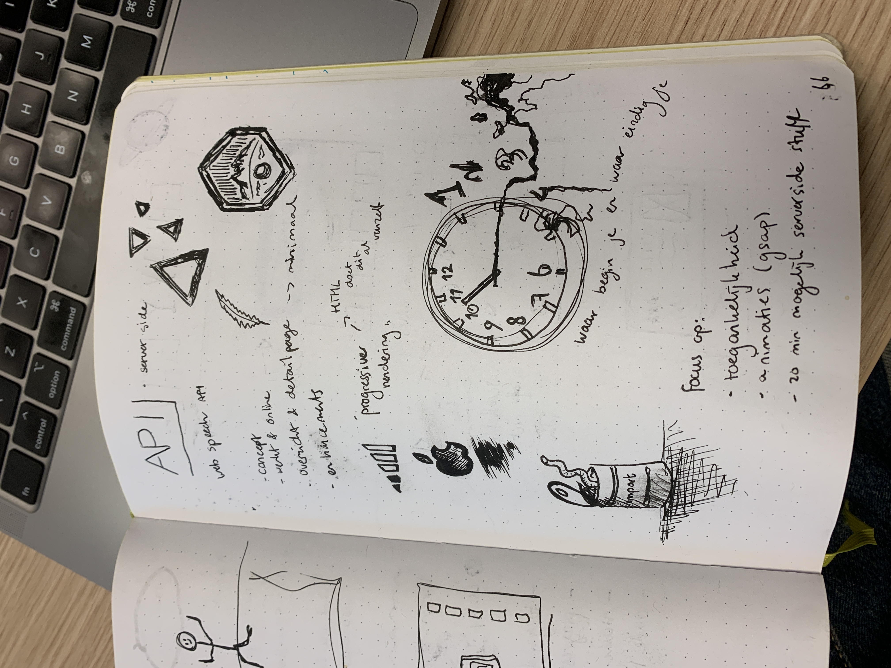
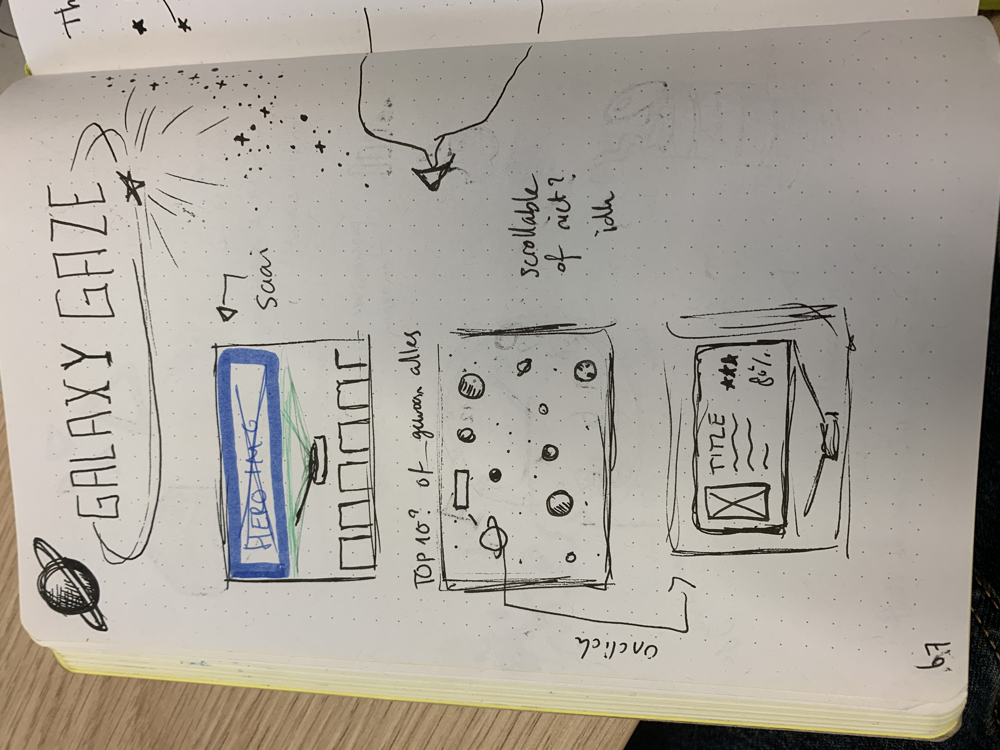
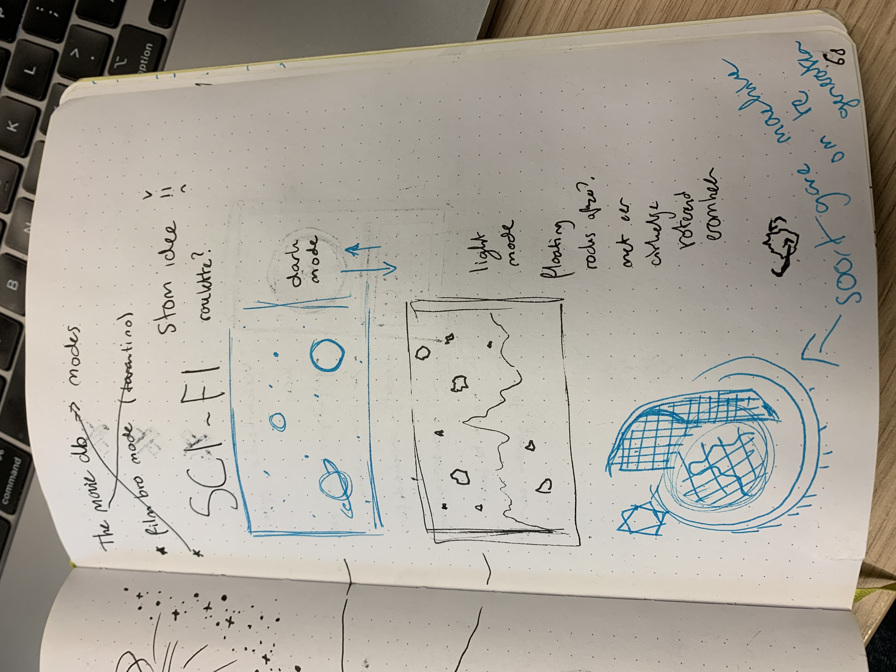
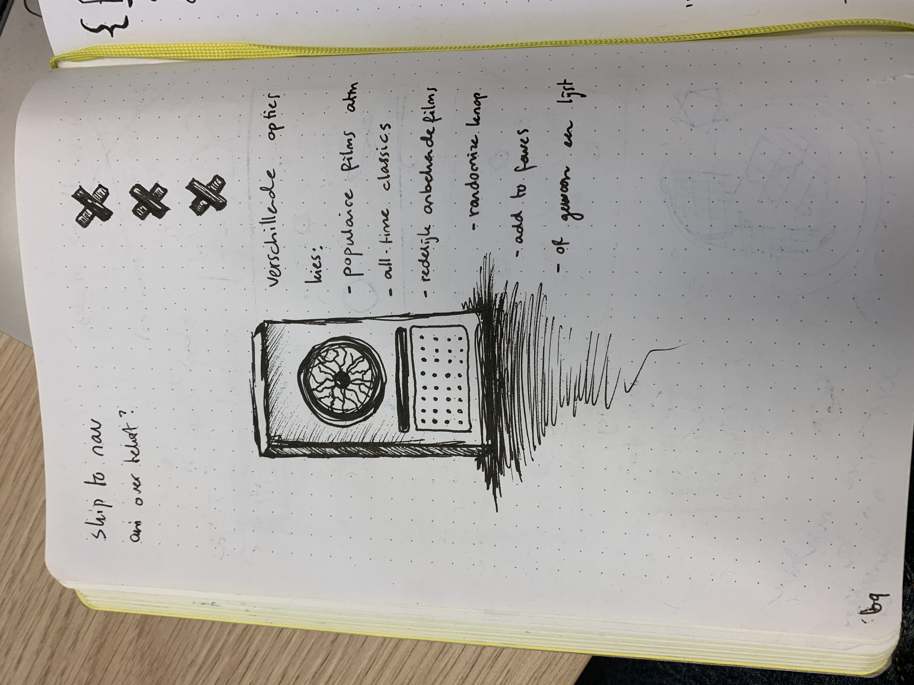

# welkom
bij api
super vet
dit was mijn proces

## week 1

## week 2

src:
- https://www.themoviedb.org/talk/56d5ef6ec3a3681e3c019e43
- https://codepen.io/shooft/pen/jORqgdg
- https://shopify.github.io/liquid/
- https://github.com/Shopify/liquid
- https://developer.mozilla.org/en-US/docs/Web/CSS/@property
- https://stackoverflow.com/questions/33879896/how-to-execute-the-start-script-with-nodemon
- https://www.w3schools.com/css/css_border.asp
